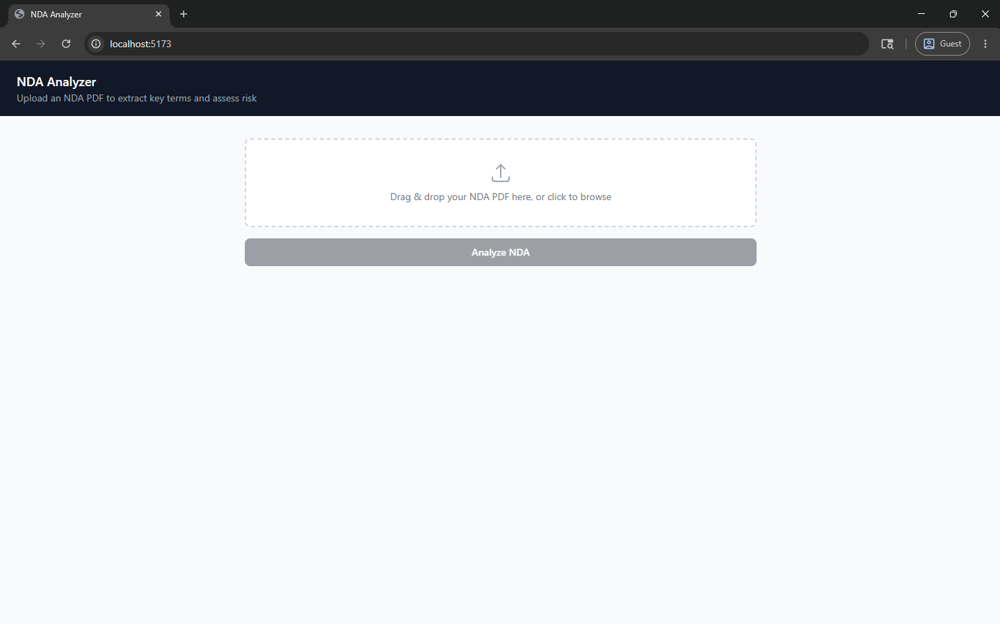
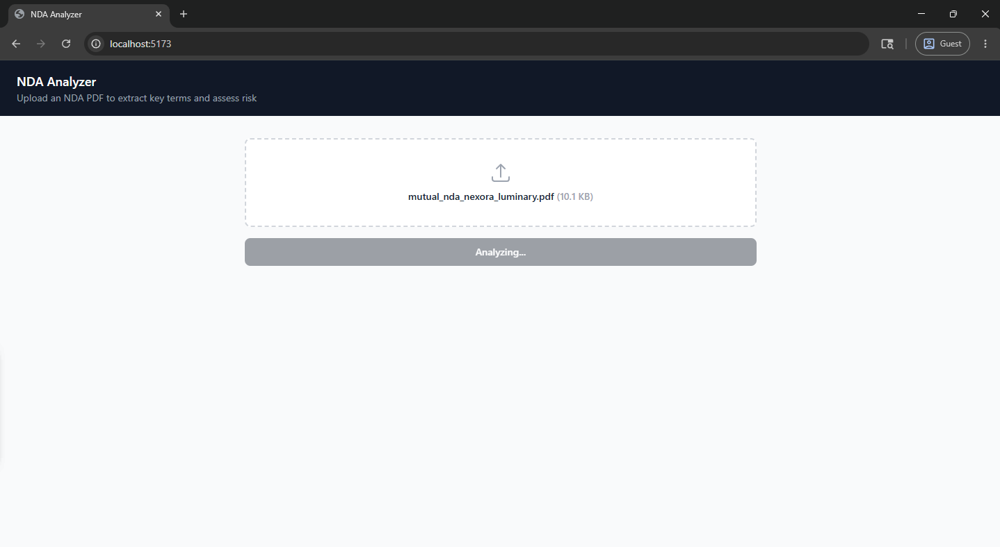
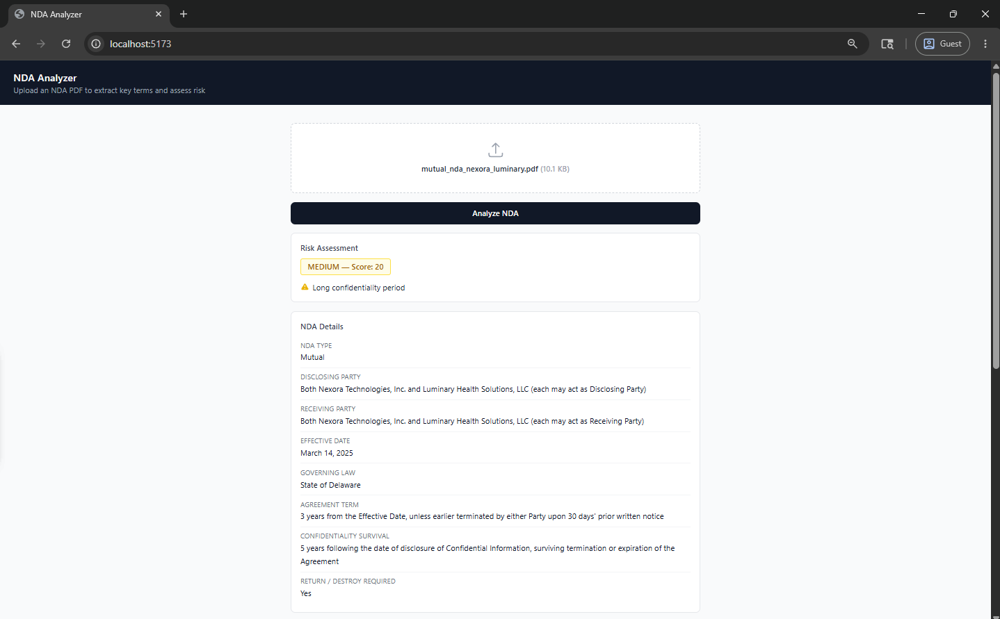
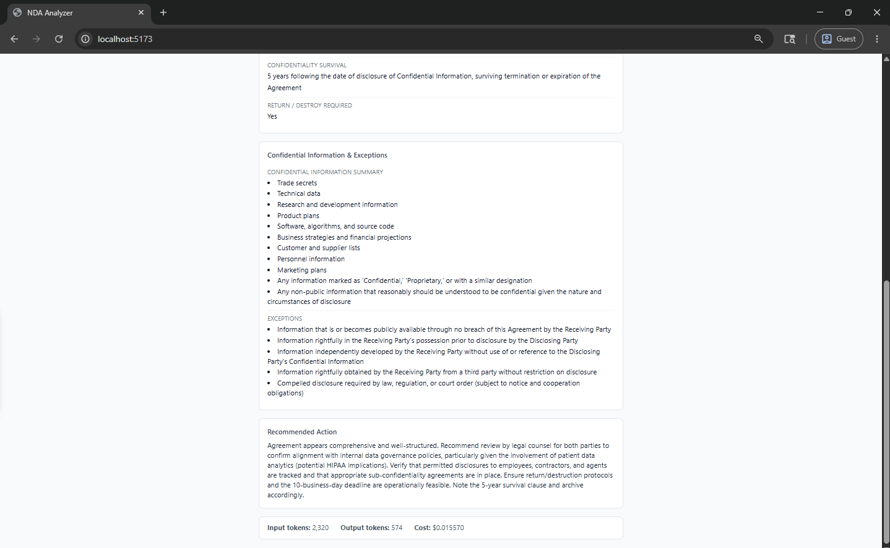

# NDA Analyzer

Upload an NDA PDF and get back structured key terms, risk flags, and a recommended action — powered by Claude AI.

## What it does

1. You upload a PDF through the browser UI
2. The backend extracts text from the PDF, sends it to Claude, and runs a rule-based risk scorer
3. The UI displays the extracted fields, risk level, token usage, and cost

## Screenshots

**1. Upload screen** — drag and drop or click to browse for a PDF



**2. Analysis in progress** — file selected, request sent to backend



**3. Results — Risk assessment & NDA details** — risk level badge, flags, and all extracted key terms



**4. Results — Confidential info, exceptions & recommended action** — full lists and Claude's recommendation, plus token usage and cost



## Project structure

```
nda-info-extractor/
├── main.py          # FastAPI app — single POST /analyze endpoint
├── pdf_reader.py    # Extracts plain text from PDF using pypdf
├── extractor.py     # Calls Claude (claude-sonnet-4-6) and parses JSON response
├── prompts.py       # System prompt for Claude
├── validation.py    # Rule-based risk scorer
└── frontend/
    └── src/
        └── App.jsx  # React UI — drag-and-drop upload + results display
```

## Setup

### Prerequisites

- Python 3.10+
- Node.js 18+
- An Anthropic API key

### Backend

```bash
python -m venv .venv
.venv\Scripts\activate        # Windows
# source .venv/bin/activate   # macOS/Linux

pip install fastapi uvicorn pypdf anthropic python-dotenv
```

Create a `.env` file in the project root:

```
ANTHROPIC_API_KEY=sk-ant-...
```

Start the server:

```bash
uvicorn main:app --reload --port 8000
```

### Frontend

```bash
cd frontend
npm install
npm run dev
```

The app will be available at `http://localhost:5173`. Vite proxies `/analyze` requests to the backend at port 8000.

## API

### `POST /analyze`

Accepts a multipart form upload with a single field `file` (PDF).

**Response (success)**

```json
{
  "nda_type": "Mutual | One-way | Unknown",
  "disclosing_party": "Acme Corp",
  "receiving_party": "Jane Doe",
  "effective_date": "January 1, 2024",
  "governing_law": "California",
  "agreement_term": "2 years",
  "confidentiality_survival": "3 years after termination",
  "return_or_destroy_required": true,
  "confidential_information_summary": ["trade secrets", "financial data"],
  "exceptions": ["publicly known information", "independently developed"],
  "recommended_action": "Review before signing — no destruction clause.",
  "validation": {
    "risk_flags": ["No data destruction requirement"],
    "risk_score": 25,
    "risk_level": "MEDIUM"
  },
  "_usage": {
    "input_tokens": 1240,
    "output_tokens": 310,
    "cost_usd": 0.008370
  }
}
```

**Response (extraction failure)**

```json
{
  "error": "invalid_json",
  "raw": "<raw model output>",
  "_usage": { ... }
}
```

## Risk scoring

| Condition | Points |
|---|---|
| Missing governing law | +10 |
| No data destruction requirement | +25 |
| Confidentiality survival ≥ 5 years | +20 |
| Contains "indefinite" | +10 |
| Contains "perpetual" | +10 |
| Contains "sole discretion" | +10 |

| Score | Level |
|---|---|
| ≥ 40 | HIGH |
| ≥ 20 | MEDIUM |
| < 20 | LOW |

## Model & cost

Uses `claude-sonnet-4-6`. Pricing at time of writing:

- Input: $3.00 / million tokens
- Output: $15.00 / million tokens

Cost per analysis is shown in the UI after each request.
